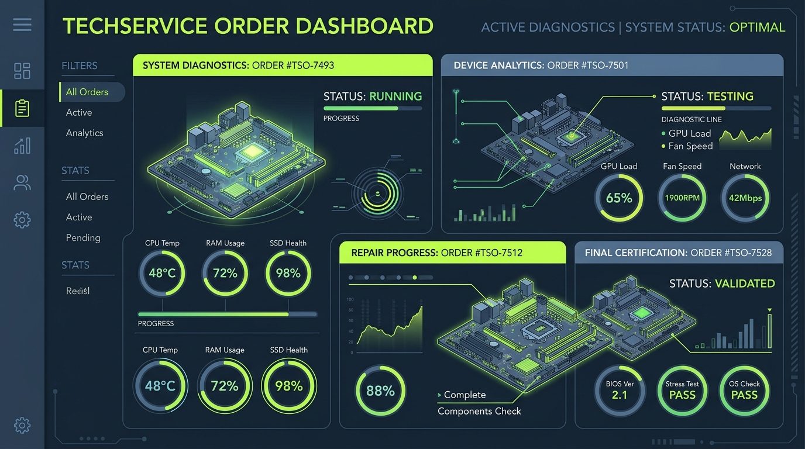

# 💻 InfoTech — Assistência Técnica Avançada & Gestão de Reparos

Bem-vindo ao **InfoTech**, uma aplicação web de altíssima fidelidade desenvolvida especificamente para modernizar a gestão de ordens de serviço, orçamentos e venda de peças de reposição em laboratórios de assistência técnica. 

Com foco em design moderno, usabilidade excepcional e recursos de nível empresarial, a InfoTech une a agilidade do **Angular 21** e do **Tailwind CSS v4** para entregar uma experiência robusta e interativa, tanto para técnicos quanto para clientes.

---

## 🎨 Design do Sistema e Identidade Visual

A InfoTech utiliza uma identidade inspirada em layouts do tipo **Bento Grid** com tons profundos de ardósia escuro (**slate-950 / zinc-950**) e acentos vibrantes em **verde esmeralda**. Cada elemento e painel foi milimetricamente projetado para garantir alto contraste, legibilidade cristalina e visual imersivo.

### 🖼️ Ilustrações do Projeto

Para ilustrar e facilitar a compreensão visual das interfaces, criamos ativos digitais conceituais que mostram os módulos principais da plataforma:

#### 1. Painel Administrativo de Diagnósticos (CRUD de Serviços e Peças)
Uma representação abstrata de hardware integrado ao painel técnico para análise de placa-mãe, memória e componentes:
<p align="center">
  
</p>

#### 2. Rastreamento e Linha do Tempo em Tempo Real
Visualização móvel e desktop com marcadores de etapas inteligentes para que o cliente acompanhe cada fase do reparo:
<p align="center">
  
</p>

---

## 🚀 Principais Recursos e Diferenciais

### 1. 🖨️ Geração de Orçamento em PDF (Pronto para Assinatura)
* **Novo Recurso**: Integrado diretamente nos cartões de Ordem de Serviço na área do cliente, no painel do técnico e na tela de rastreamento.
* **Geração Nativa e Alta Definição**: Ao clicar em **"Imprimir O.S."**, um documento de orçamento de alta fidelidade é gerado. Através do recurso `window.print()` estilizado com CSS customizado, o usuário pode **imprimir diretamente em papel** ou **salvar em PDF**.
* **Segurança Jurídica**: O documento gerado inclui um cabeçalho completo da empresa (InfoTech Ltda), detalhamento de diagnóstico, divisão clara de valores de mão de obra e peças aplicadas, termos de responsabilidade (90 dias de garantia legal) e **campos dedicados para assinatura** física do Cliente e do Técnico Responsável.
* **Estilização Inteligente (Ink Saver)**: Em tela, o preview do documento é exibido de forma elegante; durante a impressão física ou exportação de PDF, todo o ruído do site (navbar, botões, modais) é omitido e as cores são convertidas automaticamente para preto e branco de alto contraste para economizar tinta.

### 2. 🗺️ Navegação Capsule & Floating Island (Totalmente Modernizada)
* O menu superior padrão foi redesenhado para seguir os padrões das aplicações modernas de software como serviço (SaaS). 
* Possui bordas translúcidas de alta resolução, efeito de vidro fosco (`backdrop-blur-md`) e pílulas de navegação ativa com efeitos de iluminação brilhante.
* **Menu Mobile Inovador**: Um menu flutuante ancorado no estilo "Floating Dock" que flutua elegantemente no rodapé da tela do smartphone, otimizando o espaço útil e a ergonomia de toque.

### 3. 🔍 Rastreamento de Reparo em Tempo Real
* Clientes podem buscar suas ordens de serviço (ex: `OS-1001`) diretamente na página inicial sem precisar de login.
* Linha do tempo interativa com indicadores coloridos de estágio: **Recebido**, **Em Diagnóstico**, **Em Reparo**, **Testes Finais**, **Pronto para Retirada** e **Entregue**.

### 4. 💼 Área do Cliente Completa
* Histórico completo de todas as manutenções solicitadas.
* Agendamento rápido de novos reparos (CRUD) escolhendo tipo de aparelho (Notebook, Desktop, Placa-Mãe) com estimativa prévia de mão de obra.

### 5. 🛠️ Painel do Técnico (Back-Office)
* Gerenciamento centralizado de Ordens de Serviço.
* Alteração de status do reparo, inserção de laudos técnicos e adição de peças ao serviço ativo (atualizando o preço final automaticamente).
* Cadastro e controle de estoque de peças físicas (CRUD de Peças).
* Cadastro e edição de valores tabelados para serviços e atividades comuns (CRUD de Mão de Obra).

### 6. 🛒 Catálogo & Carrinho de Compras de Peças
* Venda avulsa de componentes físicos integrada ao sistema com cálculo automático de subtotal e checkout simulado em tempo real.

---

## 🛠️ Arquitetura Técnica e Tecnologias

* **Framework:** Angular 21 (Bootstrap Zoneless nativo para máxima performance).
* **Styling:** Tailwind CSS v4 (utilizando classes utilitárias de alta fidelidade para transições, animações e estética refinada).
* **State Management:** Angular Signals (`signal`, `computed`, `effect`) gerenciando de forma limpa e previsível o estado global e a reatividade do sistema.
* **Data Persistence:** `DataStore` centralizado persistindo alterações no `localStorage` do navegador para manter o progresso entre recarregamentos de página.
* **Icons:** Angular Material Icons (`<mat-icon>`).

---

## 🔑 Contas Pré-configuradas para Teste

Para facilitar a navegação rápida e validação de todas as funcionalidades, utilize as credenciais pré-carregadas na aplicação:

| Perfil de Acesso | Usuário (Username) | Senha (Password) | Acesso Permitido |
| :--- | :--- | :--- | :--- |
| **Técnico / Administrador** | `tecnico` | `123` | CRUD de Peças, Atualizar status de O.S., Incluir peças no reparo, Editar serviços. |
| **Cliente de Teste** | `cliente` | `123` | Solicitar reparos, acompanhar histórico de manutenções de Carlos Oliveira, Gerar PDF do Orçamento. |
| **Outro Cliente de Teste** | `mariana` | `123` | Acompanhar histórico de manutenções de Mariana Santos. |

---

## 🚀 Como Executar o Projeto Localmente

1. **Instalar Dependências:**
   ```bash
   npm install
   ```
2. **Iniciar Servidor de Desenvolvimento:**
   ```bash
   npm run start
   ```
   *O aplicativo estará disponível em `http://localhost:3000` (ou na porta configurada pelo servidor).*

3. **Verificar Qualidade do Código:**
   ```bash
   npm run lint
   ```
